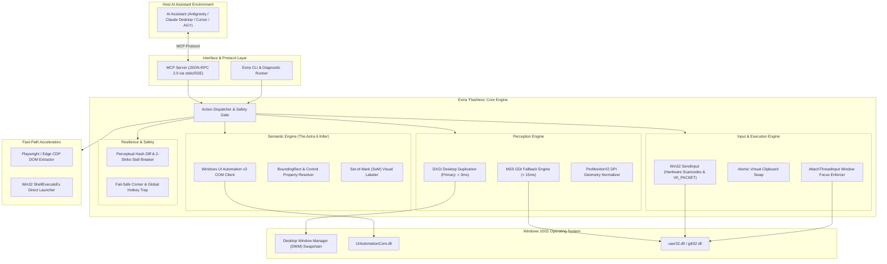

# Architecture Specification — Project "Extra"

**Document Version:** 1.0.0  
**Target Platform:** Windows 10 / Windows 11 (x86_64)  
**Parent Project:** yantraOS (`AIYantra`)  

---

## 1. System Architecture Overview

Extra is structured into five decoupled layers designed to provide sub-10ms local perception and execution while presenting a standardized **Model Context Protocol (MCP)** interface to host AI agents.



---

## 2. Core Subsystems

### 2.1 Perception Engine (`core/capture.py` & `core/geometry.py`)

#### Problem Solved:
Standard desktop screenshotting (`pyautogui.screenshot()` / `PIL.ImageGrab`) uses legacy GDI `BitBlt` that stalls the DWM composition queue, yielding 150–300ms latency and black screens on DirectX/hardware-accelerated windows (e.g. Chrome, Spotify, Edge).

#### Implementation Strategy:
1. **Primary: DirectX Desktop Duplication API (DXGI)**
   * Interfaces directly with the GPU swapchain using Direct3D 11 (`d3d11.dll` / `dxgi.dll`).
   * Captures screen buffer directly into GPU memory with sub-3ms transfer times.
   * Works across all hardware-accelerated windows without visual glitching.
2. **Secondary Fallback: MSS Engine**
   * Uses pure `ctypes` calling Microsoft's `gdi32.dll` and `user32.dll`.
   * Zero external compiled binaries; 100% immune to antivirus heuristic false positives.
3. **PerMonitorV2 Geometry Normalizer (`core/geometry.py`)**
   * Calls `SetProcessDpiAwarenessContext(DPI_AWARENESS_CONTEXT_PER_MONITOR_AWARE_V2)` (-4) at process startup.
   * Maps model-predicted normalized coordinates `[0, 1000]` or window-relative offsets into true physical screen coordinates, compensating for display scaling (125%, 150%, 200%) and multi-monitor layouts.

---

### 2.2 Semantic Engine (`core/uia_plane.py`)

#### Problem Solved:
Pure vision models hallucinate click coordinates for tiny controls, dense spreadsheets, and flat UI buttons. Vision-only loops burn millions of tokens sending full-resolution screenshots on every step.

#### Implementation Strategy:
* Connects to Microsoft's native **UI Automation Core** (`UIAutomationCore.dll`, CLSID `CUIAutomation8`).
* When an active window is targeted, Extra inspects its UIA tree:
  ```json
  {
    "control_type": "ButtonControl",
    "name": "Save As",
    "automation_id": "btn_save",
    "bounding_box": [520, 310, 600, 345],
    "is_enabled": true
  }
  ```
* **Dual-Action Capability:**
  1. **Direct Invocation:** Invokes the element's `InvokePattern` directly via COM in < 1ms, without moving the physical mouse pointer.
  2. **Physical Center Click:** Calculates `((left + right)/2, (top + bottom)/2)` and executes a hardware click with zero coordinate ambiguity.
* **Set-of-Mark (SoM) Generator:** For complex interfaces, Extra can overlay small numbered badges on all detected interactive controls, allowing the AI to simply respond with `{"click_element": 14}` rather than raw coordinates.

---

### 2.3 Input & Execution Engine (`core/input_engine.py`)

#### Problem Solved:
`pyautogui.typewrite()` types character-by-character with 50ms sleeps, drops characters when focus drifts, and completely breaks on Unicode, symbols (`₹`, `€`), and emojis.

#### Implementation Strategy:
1. **Instant Unicode Injection (`VK_PACKET`):**
   * Uses Win32 `SendInput` with `KEYEVENTF_UNICODE` (0x0004).
   * Unicode characters are piped directly into the target window's message queue without translation through keyboard layout tables.
   * 1,000 characters type in under 5ms with 100.0% fidelity.
2. **Atomic Virtual Clipboard Injection:**
   * For blocks of code or multi-line paragraphs:
     * Saves user's current clipboard text via `OpenClipboard` / `GetClipboardData`.
     * Injects the target payload.
     * Fires a hardware `Ctrl+V` scan-code.
     * Restores original clipboard contents within 10ms.
3. **Window Focus Forcing (`FocusEnforcer`):**
   * Bypasses Windows `LockSetForegroundWindow` restrictions using the `AttachThreadInput` technique: attaches the input thread to the target window's thread, issues `SetForegroundWindow`, and immediately detaches.

---

### 2.4 Resilience & Stall Breaker (`core/stall_breaker.py`)

#### Heritage:
Ported directly from yantraOS's `os/core/computer_use_bridge.py` (`EXIT_STALLED = 4`).

#### Problem Solved:
Computer use models frequently get stuck in infinite click loops when a button doesn't respond or a loading spinner freezes.

#### Implementation Strategy:
* Before any interactive click/type action, Extra captures a perceptual hash (`phash`) of the target region and records the active window handle (`HWND`).
* After the action and a brief settling delay (100–300ms), Extra captures a second hash.
* **2-Strike Rule:**
  * Strike 1: If no visual or window state change occurs, retry with an element-reacquire or scroll.
  * Strike 2: If the second attempt still produces zero change, break the loop immediately, return `status: "stalled"`, and prompt the AI to reconsider its strategy or request user intervention.
* **Emergency Safety:**
  * Corner fail-safe: Moving cursor to (0, 0) immediately halts all execution.
  * Global hotkey trap: `Ctrl+Alt+Shift+Q` forcefully terminates active tasks.

---

### 2.5 Fast-Path Accelerators (`fastpath/`)

#### 1. Shell Fast-Path (`fastpath/shell.py`)
* Instead of letting the AI click around the desktop looking for an app icon, Extra exposes direct launchers for standard Windows tools:
  * Calculator (`calc.exe`), File Explorer (`explorer.exe`), Settings (`ms-settings:`), Terminal (`wt.exe` / `cmd.exe`), Browsers (Chrome, Edge, Firefox, Brave).
* Uses `ShellExecuteEx` with verified system paths.

#### 2. Browser Fast-Path (`fastpath/browser.py`)
* Powered by Microsoft Playwright / Edge CDP connection.
* When executing web research, scraping, or form submission, Extra bypasses pixel recognition entirely, extracting the semantic DOM tree and filling inputs directly.

---

## 3. The Model Context Protocol (MCP) Contract

Extra implements the standard Anthropic MCP specification (`mcp>=1.0.0`) over `stdio`, allowing one-click integration into **Claude Desktop**, **Antigravity**, **Cursor**, and custom agent frameworks.

### Exposed MCP Tools:

| Tool Name | Parameters | Description |
| :--- | :--- | :--- |
| `extra_screenshot` | `monitor_index` (int), `crop_box` (list), `annotate_ui` (bool) | Captures ultra-fast screen frame. Optionally overlays Set-of-Mark numbers. |
| `extra_click` | `x` (int), `y` (int), `button` (str), `clicks` (int) | Hardware-level mouse click with PerMonitorV2 DPI compensation. |
| `extra_type` | `text` (str), `press_enter` (bool), `use_clipboard` (bool) | Zero-latency Unicode text injection. |
| `extra_hotkey` | `keys` (list[str]) | Executes key combinations (e.g. `["ctrl", "shift", "esc"]`, `["win", "r"]`). |
| `extra_inspect_ui` | `window_title` (str), `max_depth` (int) | Returns interactive Windows UI Automation tree with bounding boxes. |
| `extra_click_element` | `element_id` (str or int) | Clicks an inspected UIA element or Set-of-Mark badge directly. |
| `extra_launch` | `app_name` (str), `args` (list[str]) | Deterministic Win32 fast-path app launch. |
| `extra_browser` | `action` (str), `url` (str), `selector` (str), `value` (str) | Playwright/Edge CDP web fast-path. |

---

## 4. Security & Trust Architecture

### 4.1 Dependency Audit & Pedigree
To guarantee enterprise adoption and zero Windows Defender / SmartScreen warnings:
* **Microsoft Official:** `playwright` (Apache-2.0).
* **Anthropic Official:** `mcp` (MIT).
* **Python Software Foundation:** `pillow`, `comtypes`, standard library `ctypes`.
* **Zero Solo-Dev Binary Blobs:** Low-level OS capabilities invoke Microsoft's own pre-installed DLLs:
  * `user32.dll` (Input injection, window focus, system metrics)
  * `gdi32.dll` (Screen capture fallback)
  * `shcore.dll` (DPI awareness contexts)
  * `UIAutomationCore.dll` (Microsoft UI Automation COM server)
  * `dxgi.dll` / `d3d11.dll` (DirectX Desktop Duplication)

### 4.2 Security Boundaries
* **User-Space Only:** No kernel drivers (`.sys`), no driver signing issues.
* **No Telemetry / Sovereign:** Extra contains zero tracking or third-party phone-home calls. All communications remain strictly local between the AI agent and the local Windows system.
