# Architecture Specification — Project "Extra" for macOS

**Document Version:** 1.0.0  
**Target Platform:** macOS 12.3+ (Monterey, Ventura, Sonoma, Sequoia)  
**Supported Architectures:** Apple Silicon (M1/M2/M3/M4, `arm64`) & Intel (`x86_64`)  
**Parent Project:** yantraOS (`AIYantra`)  

---

## 1. System Architecture Overview

Extra for macOS is structured into five decoupled layers engineered to provide sub-10ms local perception and deterministic execution on Apple platforms, while preserving the 100% standardized **Model Context Protocol (MCP)** interface for host AI assistants.

```mermaid
flowchart TD
    subgraph HostAI["Host AI Assistant Environment"]
        Agent["AI Assistant (Antigravity / Claude Desktop / Cursor / AGY)"]
    end

    subgraph InterfaceLayer["Interface & Protocol Layer (Cross-Platform)"]
        MCPServer["MCP Server (JSON-RPC 2.0 via stdio/SSE)"]
        CLIEngine["Extra CLI & Diagnostic Runner (cli.py)"]
    end

    subgraph CoreEngine["Extra 'Flashless' Core Engine (macOS Native)"]
        Router["Action Dispatcher & Safety Gate"]
        
        subgraph Perception["Perception Engine"]
            SCKit["ScreenCaptureKit (Primary: < 5ms GPU VRAM)"]
            QuartzCap["CoreGraphics CGDisplayCreateImage Fallback (< 10ms)"]
            RetinaDPI["Retina BackingScaleFactor & Y-Inversion Normalizer"]
        end

        subgraph Semantic["Semantic Engine (The Astra 6 Killer)"]
            AXTree["ApplicationServices AXUIElement System-Wide Client"]
            ElementResolver["BoundingRect & Control Property Resolver"]
            SoM["Set-of-Mark (SoM) Retina Badge Labeler"]
        end

        subgraph Injection["Input & Execution Engine"]
            CGEventPost["CoreGraphics Event Tap (CGEvent Unicode & HID)"]
            AtomicClip["NSPasteboard Atomic Virtual Swap"]
            FocusEnforcer["NSRunningApplication Activate Enforcer"]
        end

        subgraph Resilience["Resilience & Safety"]
            StallBreaker["Perceptual Hash Diff & 2-Strike Stall Breaker"]
            KillSwitch["Fail-Safe Corner (0, 0) & Cmd+Opt+Shift+Q Hook"]
        end

        subgraph AmbientAwareness["Ambient Awareness & Feedback"]
            NSPanelOverlay["Borderless Floating NSPanel (sharingType=.none)"]
            AudioSynth["Procedural Glass Marimba Synthesizer (NSSound/CoreAudio)"]
        end
    end

    subgraph FastPath["Fast-Path Accelerators"]
        BrowserFast["Playwright / Chrome & Safari CDP DOM Extractor"]
        ShellFast["macOS App Bundle & 'open -a' Direct Launcher"]
    end

    subgraph DarwinKernel["macOS Darwin & Apple Frameworks"]
        SCKFramework["ScreenCaptureKit.framework"]
        CGFramework["CoreGraphics.framework / QuartzCore.framework"]
        AppKitFramework["AppKit.framework / Cocoa"]
        AXFramework["ApplicationServices.framework (HIServices/AXUIElement)"]
        TCCSubsystem["TCC Subsystem (Accessibility & Screen Recording)"]
    end

    Agent <-->|MCP Protocol| MCPServer
    MCPServer --> Router
    CLIEngine --> Router

    Router --> Perception
    Router --> Semantic
    Router --> Injection
    Router --> FastPath
    Router --> Resilience
    Router --> AmbientAwareness

    SCKit --> SCKFramework
    QuartzCap --> CGFramework
    AXTree --> AXFramework
    CGEventPost --> CGFramework
    FocusEnforcer --> AppKitFramework
    NSPanelOverlay --> AppKitFramework
    AudioSynth --> AppKitFramework
    Perception -.->|Guarded by| TCCSubsystem
    Injection -.->|Guarded by| TCCSubsystem
    Semantic -.->|Guarded by| TCCSubsystem
```



---

## 2. Core Subsystems & Technical Mechanics

### 2.1 Perception Engine (`core/platform/macos/capture.py` & `geometry.py`)

#### Problem Solved:
Standard Python desktop screenshotting (`pyautogui.screenshot()` / `PIL.ImageGrab`) on macOS invokes the legacy `/usr/sbin/screencapture` CLI utility or slow CPU memory copies, introducing 150–400ms latency, high CPU load, and permission stalls.

#### Implementation Strategy:
1. **Primary: ScreenCaptureKit (`ScreenCaptureKit.framework`)**
   * Introduced in macOS 12.3 Monterey, ScreenCaptureKit interfaces directly with the Metal display compositor and unified GPU memory on Apple Silicon.
   * Delivers raw frame buffers in `< 5ms` with zero compositor tearing.
   * **Invisibility Filter**: Uses `SCContentFilter` to selectively exclude Extra's own indicator overlays from captured screenshots by window ID, preventing the AI from hallucinating glowing green borders.
2. **Secondary Fallback: Quartz CoreGraphics (`CGDisplayCreateImage`)**
   * Directly extracts the active display frame buffer into a `CGImageRef`.
   * Zero-copy pointer extraction via `CGImageGetDataProvider` and `CGDataProviderCopyData`.
   * Operates in `< 10ms` on Apple Silicon M-series chips.
3. **Retina Display Normalization & Inverted Y-Axis Geometry (`geometry.py`)**
   * **Point vs. Pixel Coordinate Mapping**: macOS displays define geometry in logical points (e.g., `1728 x 1117`), while the physical backing store is rendered at 2x Retina scale (`3456 x 2234`, `NSScreen.backingScaleFactor = 2.0`).
   * **Origin Normalization**: macOS Quartz coordinates place origin `(0, 0)` at the **bottom-left** of the primary display with positive Y pointing upward, whereas `AXUIElement` positions, Windows, and web models use top-left origin with positive Y pointing downward.
   * Extra's geometry layer normalizes all coordinates into a unified `[0, 1000]` top-left scale and automatically converts between points and physical Retina pixels.

---

### 2.2 Semantic Engine (`core/platform/macos/ax_plane.py`)

#### Problem Solved:
Pure vision models struggle to locate small controls, dense menu bars, and flat UI elements. Inspecting full-resolution 4K Retina screenshots on every step burns tens of thousands of vision tokens per interaction.

#### Implementation Strategy:
* Connects to Apple's native **Accessibility API** (`ApplicationServices.framework` / `HIServices`) via `AXUIElementCopyAttributeValue`.
* Queries the system-wide UI tree via `AXUIElementCreateSystemWide()`.
* **Tree Traversal & Attribute Resolution**:
  ```json
  {
    "role": "AXButton",
    "title": "Save",
    "identifier": "save_document_button",
    "bounding_box": [450, 180, 520, 215],
    "is_enabled": true
  }
  ```
* **Dual-Action Execution**:
  1. **Direct Action Invocation**: Calls `AXUIElementPerformAction(raw_elem, kAXPressAction)` directly. Activates buttons, checkboxes, tabs, and menu items in `< 1ms` without moving the mouse pointer.
  2. **Geometric Center Click**: Computes `(x + width/2, y + height/2)` with Retina scale compensation and dispatches a hardware event.
* **Set-of-Mark (SoM) Generator**: Overlays high-contrast, Retina-scaled numbered badges directly on interactive elements, allowing AI agents to reply with `{"element_id": 12}` instead of calculating raw coordinates.

---

### 2.3 Input & Execution Engine (`core/platform/macos/input_engine.py`)

#### Problem Solved:
Standard tools type character-by-character with 50ms sleeps, drop characters when macOS input sources (IMEs) switch, and break on Unicode, accented characters, and emojis.

#### Implementation Strategy:
1. **Instant Unicode Injection via Event Taps**:
   * Uses `CGEventCreateKeyboardEvent(None, 0, True)`.
   * Calls `CGEventKeyboardSetUnicodeString(event, len(text), text)`.
   * Unicode characters (including emojis, multi-byte Asian scripts, and technical symbols) are piped directly into the system HID event tap without translating through macOS keyboard layout maps (`TISCopyCurrentKeyboardInputSource`).
   * Injects 500 characters in under 3ms with 100.0% fidelity.
2. **Hardware Mouse Dispatch**:
   * Dispatches `kCGEventLeftMouseDown`, `kCGEventLeftMouseUp`, `kCGEventRightMouseDown`, and `kCGEventMouseMoved` directly to `kCGHIDEventTap`.
   * Sets `kCGMouseEventClickState` to `2` or `3` for instant double/triple click dispatch.
3. **Atomic Virtual Clipboard Swap**:
   * Saves current clipboard items via `NSPasteboard.generalPasteboard().pasteboardItems()`.
   * Writes target text to pasteboard with `NSPasteboardTypeString`.
   * Fires hardware `Command+V` keystroke.
   * Restores original pasteboard items in `< 20ms`.
4. **Window Focus & Activation (`focus.py`)**:
   * Eliminates the foreground-lock timeout bugs common on Windows.
   * Activates target applications cleanly via `NSRunningApplication.runningApplicationWithProcessIdentifier_(pid).activateWithOptions_(NSApplicationActivateIgnoringOtherApps)`.

---

### 2.4 Ambient Awareness & Feedback Subsystem (`core/platform/macos/indicators.py`)

#### Problem Solved:
Autonomous computer use can feel disorienting to human users if actions occur invisibly, while persistent visual overlays risk contaminating AI vision screenshots.

#### Implementation Strategy:
1. **Visual Ambient Border Glow**:
   * Uses an `AppKit.NSPanel` floating window spanning the active screen bezels.
   * `styleMask = NSWindowStyleMaskBorderless | NSWindowStyleMaskNonactivatingPanel`.
   * `ignoresMouseEvents = True` (100% click-through; zero interference with user or agent clicks).
   * `level = NSStatusWindowLevel` (floats above all desktop windows).
   * **Invisibility to Perception Engine**: Setting `sharingType = NSWindowSharingNone` ensures `ScreenCaptureKit` and `CGDisplayCreateImage` completely bypass the overlay. The user sees a pulsating neon-cyan border or emerald-green completion aurora, but the AI vision model receives a clean screenshot.
2. **Luxury Harmonic Audio Chime**:
   * Procedural audio synthesis running entirely in RAM (zero disk I/O, zero external MP3/WAV dependencies).
   * Generates a studio-grade glass marimba chord: E6 (1318.5 Hz) → G#6 (1661.2 Hz) → B6 (1975.5 Hz) with warm E4 (329.6 Hz) acoustic resonance.
   * Plays asynchronously via `AppKit.NSSound` with zero main-thread blocking.

---

### 2.5 Resilience & Closed-Loop Stall Breaker (`core/stall_breaker.py`)

#### Problem Solved:
Computer use models frequently get trapped in infinite clicking loops when buttons don't react, network calls spin, or dialog boxes fail to open.

#### Implementation Strategy:
* Before any click or type action, Extra captures a perceptual hash (`imagehash.phash`) of the target screen area and queries the active focused application PID.
* After action execution and a 150ms settling window, Extra captures a post-action hash.
* **The 2-Strike Rule**:
  * **Strike 1**: If no perceptual hash delta or window state change is detected, Extra alerts the agent with `status: "warning"`.
  * **Strike 2**: If the second attempt still produces zero visual or state progress, Extra forcefully aborts the loop with `status: "stalled"`, stopping runaway token burn.
* **Emergency Safety & Fail-Safes**:
  * **Corner Abort**: Moving the physical cursor to `(0, 0)` immediately terminates execution.
  * **Global Hotkey Trap**: Holding `Command + Option + Shift + Q` triggers an immediate `EmergencyAbortError`.

---

### 2.6 Fast-Path Accelerators (`fastpath/`)

#### 1. macOS Shell Fast-Path (`fastpath/shell.py`)
* Instead of requiring the AI to click the Launchpad or Spotlight search bar to find apps, Extra exposes deterministic fast-launchers:
  * Calculator (`/System/Applications/Calculator.app`)
  * TextEdit (`/System/Applications/TextEdit.app`)
  * Terminal (`/System/Applications/Utilities/Terminal.app`)
  * System Settings (`/System/Applications/System Settings.app`)
  * Finder (`/System/Library/CoreServices/Finder.app`)
  * Browsers (Safari, Google Chrome, Microsoft Edge, Brave, Arc)
* Resolves `.app` bundle paths and dispatches via `/usr/bin/open -a` or `NSWorkspace`.

#### 2. Browser Fast-Path (`fastpath/browser.py`)
* Powered by Playwright / Chromium & Safari WebKit CDP.
* Bypasses screen pixels completely for web research and form filling, directly extracting semantic DOM trees and saving vision tokens.

---

## 3. Model Context Protocol (MCP) Contract

Extra for macOS preserves the identical Anthropic Model Context Protocol (`mcp>=1.0.0`) tool signatures as the Windows version, ensuring that prompts, agent rules, and client configurations are 100% portable between operating systems.

### Exposed MCP Tools:

| Tool Name | Parameters | Description |
| :--- | :--- | :--- |
| `extra_screenshot` | `monitor_index` (int), `crop_box` (list), `annotate_ui` (bool) | Captures hardware screen frame (< 8ms). Optionally overlays Set-of-Mark numbered badges. |
| `extra_click` | `x` (int), `y` (int), `button` (str), `clicks` (int) | Hardware-level mouse click with Retina backing-scale compensation. |
| `extra_type` | `text` (str), `press_enter` (bool) | Zero-latency Unicode text injection via CoreGraphics event taps. |
| `extra_hotkey` | `keys` (list[str]) | Executes macOS key combinations (e.g. `["cmd", "space"]`, `["cmd", "shift", "3"]`). |
| `extra_inspect_ui` | `max_elements` (int), `interactive_only` (bool) | Returns active application's `AXUIElement` semantic accessibility tree with bounding boxes. |
| `extra_click_element` | `element_id` (int) | Clicks an inspected accessibility element or Set-of-Mark badge directly. |
| `extra_launch` | `app_name` (str), `args` (list[str]) | Deterministic macOS app bundle launcher via `open -a` or `NSWorkspace`. |
| `extra_browser` | `action` (str), `url` (str), `selector` (str), `value` (str) | Playwright / CDP browser fast-path. |
| `extra_focus_window` | `window_title` (str), `pid` (int) | Asserts foreground window focus via `NSRunningApplication`. |
| `extra_task_start` | `task_name` (str) | Activates ambient cyan screen border glow and cursor halo. |
| `extra_task_complete`| `summary` (str), `success` (bool) | Flashes emerald-mint completion border, plays glass marimba chord chime, and cleans up. |
| `extra_indicate_status`| `status` (str), `message` (str) | Real-time status update to visual/auditory controller. |

---

## 4. Security, Trust & TCC Boundary Architecture

### 4.1 Dependency Audit & Zero Solo-Dev Blobs
Extra for macOS relies exclusively on official, auditable packages:
* **Anthropic Official**: `mcp` (MIT)
* **Microsoft Official**: `playwright` (Apache-2.0)
* **Apple Official**: Native macOS frameworks via `pyobjc` (PSF / Apple licensed):
  * `ScreenCaptureKit.framework` (Sub-5ms GPU screen capture)
  * `CoreGraphics.framework` / `Quartz.framework` (HID event synthesis & display queries)
  * `ApplicationServices.framework` / `HIServices` (AXUIElement accessibility tree)
  * `AppKit.framework` (Window management, pasteboard, audio, and visual panels)
* **Python Software Foundation & Scipy**: `pillow`, `numpy`, `imagehash`, `psutil`.
* **Zero Third-Party Binary Blobs**: All OS interaction occurs through Apple's signed system dynamic libraries (`/System/Library/Frameworks/`).

### 4.2 Apple TCC (Transparency, Consent, and Control) Framework
macOS requires explicit user authorization before applications can inspect or automate other software:

```
┌────────────────────────────────────────────────────────────────────────┐
│                      MACOS TCC PERMISSION GATES                        │
├──────────────────────────┬─────────────────────────────────────────────┤
│ Permission Type          │ Function in Extra                           │
├──────────────────────────┼─────────────────────────────────────────────┤
│ Accessibility            │ • AXUIElement semantic tree inspection      │
│                          │ • CGEventPost hardware mouse/keyboard taps  │
├──────────────────────────┼─────────────────────────────────────────────┤
│ Screen Recording         │ • ScreenCaptureKit & CGDisplayCreateImage   │
├──────────────────────────┼─────────────────────────────────────────────┤
│ Automation (AppleEvents) │ • Optional: ScriptingBridge / AppleScript   │
└──────────────────────────┴─────────────────────────────────────────────┘
```

Extra includes a built-in diagnostic runner (`python -m extra.cli doctor`) that tests every TCC capability on startup and presents direct, one-click system settings links if a permission is missing.
