# 24-Hour Launch Roadmap & Execution Checklist — Project "Extra"

**Launch Target:** 24 Hours from Kickoff  
**Ecosystem:** yantraOS / AIYantra  
**Target Repository:** `AIYantra/extra` (`extra.yantraos.com`)  

---

## 24-Hour Sprint Schedule

```mermaid
gantt
    title Extra 24-Hour Launch Sprint
    dateFormat  X
    axisFormat  Hour %d

    section Phase 0: Foundation
    PRD, Architecture, Memory, Roadmap     :done,    p0, 0, 2

    section Phase 1: Core Engine
    DPI Geometry & Screen Capture          :active,  p1_1, 2, 5
    Win32 SendInput & Clipboard            :         p1_2, 5, 7
    Windows UIA v3 Semantic COM Layer      :         p1_3, 7, 9
    Stall Breaker & Safety System          :         p1_4, 9, 10

    section Phase 2: Protocols & FastPath
    Fast-Path (Shell & Playwright DOM)     :         p2_1, 10, 12
    MCP Server (Model Context Protocol)    :         p2_2, 12, 14
    CLI Runner & Diagnostics               :         p2_3, 14, 15

    section Phase 3: Installer & Prompts
    install.ps1 (1-line Windows setup)     :         p3_1, 15, 17
    STARTER_PROMPT.md & Config Templates   :         p3_2, 17, 18

    section Phase 4: Launch Assets
    Landing Page (extra.yantraos.com)      :         p4_1, 18, 20
    Demo Recording & Walkthrough Assets    :         p4_2, 20, 22
    GitHub Repo Prep & Announcement        :         p4_3, 22, 24
```

---

## Detailed Task Breakdown

### Phase 0: Foundation & Specifications [COMPLETED]
- [x] Product Requirements Document (`PRD.md`)
- [x] Architecture Specification (`ARCHITECTURE.md`)
- [x] Project Memory & ADRs (`MEMORY.md`)
- [x] 24-Hour Roadmap & Sprint Plan (`ROADMAP.md`)
- [x] Production Requirements Manifest (`requirements.txt`)
- [x] Master Project Overview (`README.md`)

---

### Phase 1: Core Engine Implementation [COMPLETED]
- [x] `extra/core/geometry.py`: Implemented `SetProcessDpiAwarenessContext(PER_MONITOR_AWARE_V2)`, multi-monitor coordinate math, and bounding box normalization.
- [x] `extra/core/capture.py`: Implemented high-speed screen capture with isolated worker thread, sub-15ms ROI cropping, and base64 compression.
- [x] `extra/core/input_engine.py`: Implemented Win32 `SendInput` with `KEYEVENTF_UNICODE` for zero-delay typing, atomic clipboard injection, and hardware mouse clicks.
- [x] `extra/core/focus.py`: Implemented `AttachThreadInput` window focus enforcement to guarantee active window targeting.
- [x] `extra/core/uia_plane.py`: Implemented Microsoft `UIAutomationCore.dll` COM wrapper for instant semantic element lookup and direct `InvokePattern` activation.
- [x] `extra/core/stall_breaker.py`: Implemented perceptual hash diffing (`phash`), 2-strike loop breaker, and emergency corner abort `(0, 0)`.

---

### Phase 2: Fast-Path & MCP Server [COMPLETED]
- [x] `extra/fastpath/shell.py`: Deterministic app launcher for Windows standard tools (`calc`, `explorer`, `settings`, `cmd`, `browsers`).
- [x] `extra/fastpath/browser.py`: Microsoft Playwright / Edge connection for direct semantic DOM extraction without vision overhead.
- [x] `extra/mcp/server.py`: Official Anthropic Model Context Protocol (MCP) server exposing tools:
  - `extra_screenshot`
  - `extra_click`
  - `extra_type`
  - `extra_hotkey`
  - `extra_inspect_ui`
  - `extra_click_element`
  - `extra_launch`
  - `extra_browser`
  - `extra_focus_window`
  - `extra_scroll`
  - `extra_drag`
- [x] `extra/cli.py`: Standalone CLI with commands: `extra run`, `extra test`, `extra doctor`, `extra inspect`, `extra snap`.

---

### Phase 3: Packaging & Installer [COMPLETED]
- [x] `extra/install.ps1`: Windows PowerShell 1-liner installer:
  - Verifies Python 3.10+ (with automated winget installation fallback).
  - Creates isolated `.venv`.
  - Installs verified enterprise-clean dependencies.
  - Automatically configures Claude Desktop (`claude_desktop_config.json`) and Antigravity MCP settings.
  - Generates global `extra` CLI launcher and tests system readiness via `extra doctor`.
- [x] `extra/STARTER_PROMPT.md`: Master system prompt guiding the AI assistant on how to utilize Extra with maximal speed and zero hallucinations.
- [x] `extra/pyproject.toml`: Modern packaging definition and CLI entrypoint for `pip install -e .`.
- [x] `extra/claude_desktop_config.template.json`: Reference MCP configuration template.

---

### Phase 4: Launch Assets & Community Release (Target: Hours 18 – 24)
- [x] `extra.yantraos.com/`: Minimalist, high-conversion dark-mode web application and landing page:
  - Full Shadcn UI integration with Radix Nova and Lucide icons.
  - Cyber-Industrial Sovereign Engine design system (`design-system/MASTER.md` and `design-system/pages/landing.md`).
  - Interactive Dual-Plane Perception visualizer (Set-of-Mark OCR vs COM UIAutomation hierarchy vs Fast-Path CDP).
  - 1-Line PowerShell installer (`irm https://extra.yantraos.com/install.ps1 | iex`) with self-hosted script in `public/install.ps1`.
  - 11 MCP Tools interactive catalog and 1-click Claude Desktop / Antigravity integration guide.
  - Official brand logos integrated (`/logo.png`, `/logo-square.png`, `/social-preview.png`).
- [ ] Record a 45-second demo: Extra autonomously automating a complex Windows 11 task across native apps and browser.
- [ ] Push to `github.com/AIYantra/extra` under MIT License.
- [ ] Launch announcement thread for X (Twitter), LinkedIn, Reddit (r/LocalLLaMA, r/MachineLearning), and Hacker News.
